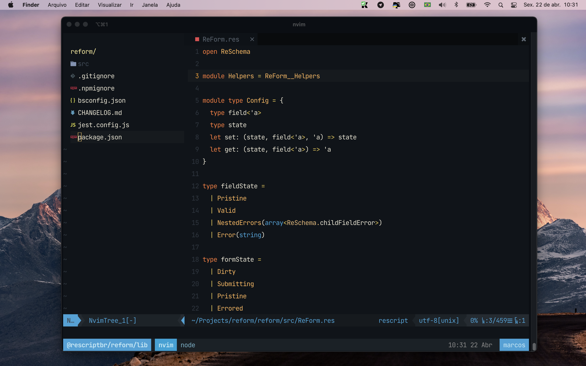

   
  
   
 

 

## Resources 📦

### nvim :nerd:
  - `nvim.bufferline`
  - `nvim.tree`
  - Theme ➡️ `mhartington/oceanic-next`
  - `coc.nvim` + `vim-rescript`
  - My custom shortcuts

### zsh
  - zshrc
  - ohmyzsh
  - zsh-nvm

## tmux
  - My custom themes (`oceanic-next`, `gruvbox`, `iceberg` and `ayu`)
  - `oh-my-tmux`
  - tmux resurrect

### resources
  - `.editorconfig`
  - `.gitconfig`

## LICENSE

WTFPL
