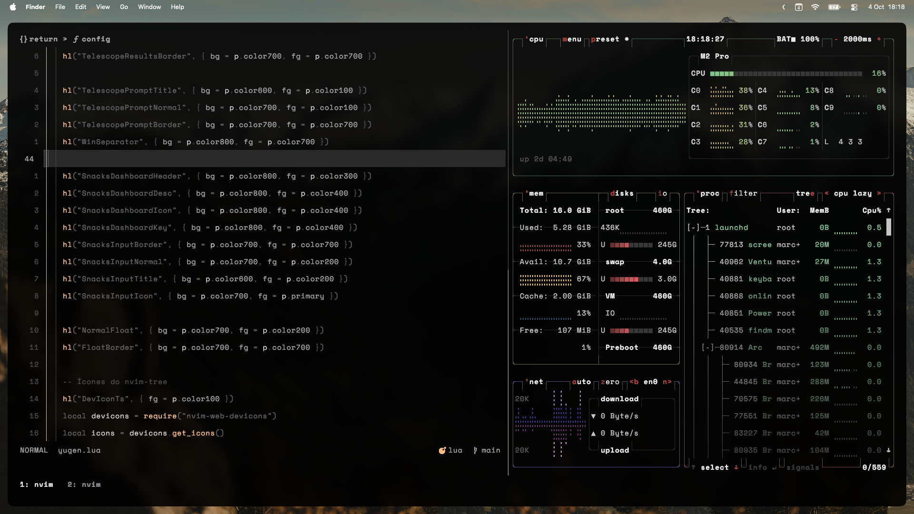
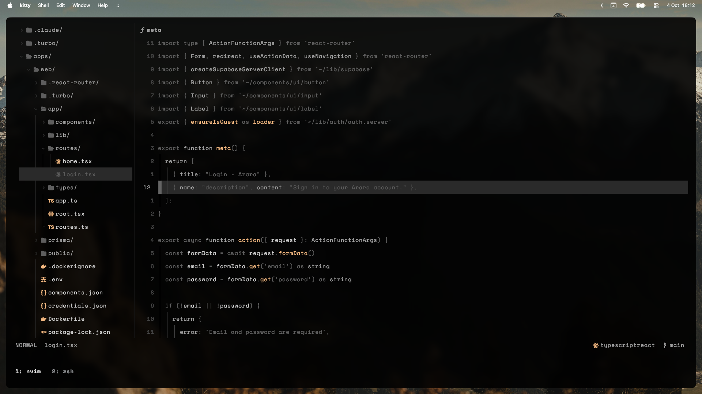
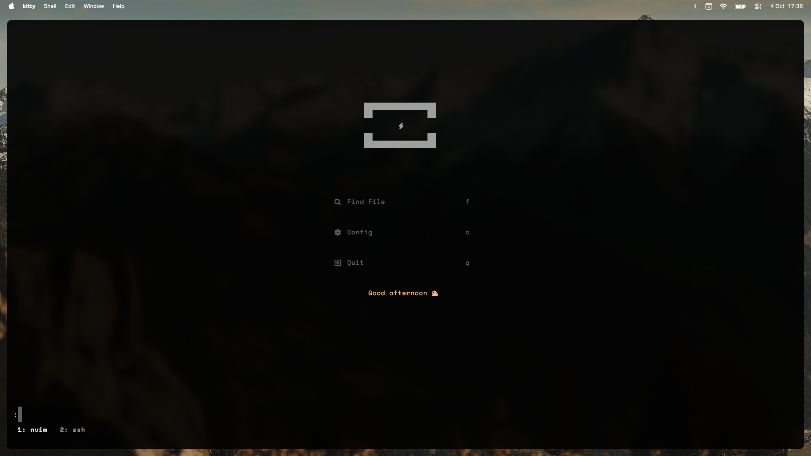
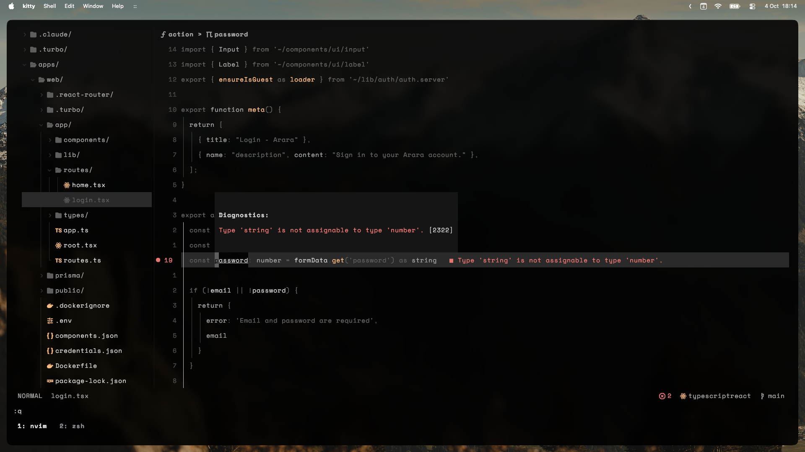
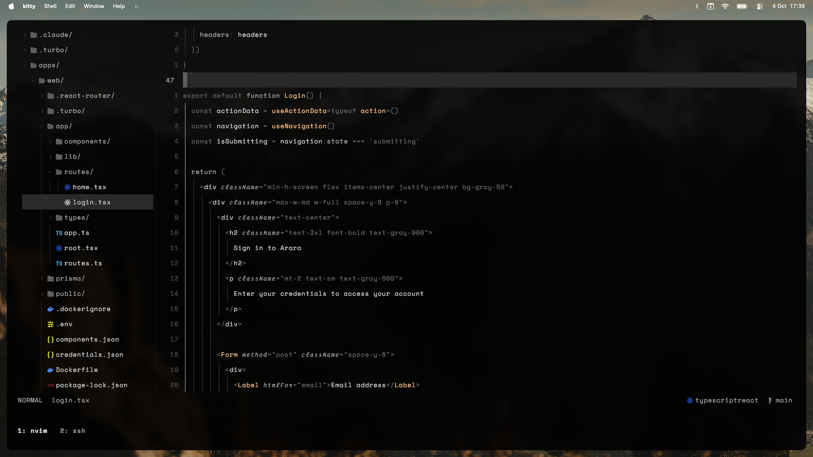

<samp>

<h1 align="center"><code>$dotfiles</code></h1>

  

<h2 align="center">Preview</h1>

  

Editor

  

Dashboard

  

File finder

  

Diagnostics

<h2 align="center">Overview</h1>

### ⌨️ Neovim —— [BetterVim](https://bettervim.com)
- My BetterVim config: `bettervim/bettervim.lua`
- My own theme ([yugen 幽玄](https://github.com/bettervim/yugen))

### 💡 ZSH
  - `.zshrc`
  - My `oh-my-zsh` config
  - Support for `nvm`
  - Some useful aliases and functions

### ⌨️ Kitty 🐱
 - My custom configs
 - My own theme (yugen 幽玄)

### 🖥️ TMUX
  - My custom `tmux` config
  - Support for `tpm` (tmux plugins manager)
      - `tmux-sensible` config.
      -  `tmux-ressurrect` config
  -  My own theme (yugen 幽玄)

### 📦 General
  - `.editorconfig`
  - `.gitconfig`

## 💬 Inspiration
- [alex35mil/dotfiles](https://github.com/alex35mil/dotfiles)

## ⚖️ license
MIT
</samp>
