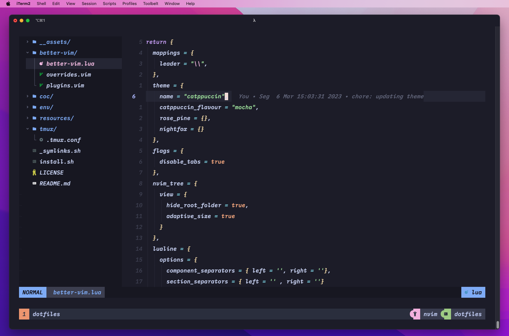

# :bulb: `~/.dotfiles`
<h2 align="center">
  
   
 </h2>

### ⌨️ Neovim —— [BetterVim](https://bettervim.com)
- BetterVim files (`~/better-vim/`)
- `coc.nvim` config

### 💡 zsh
  - `.zshrc`
  - `oh-my-zsh` config
  - Support for `nvm`

### 🖥️ tmux
  - My custom `tmux` config
  - Support for `tpm` (tmux plugins manager)
  - Themes like `catppuccin`
  - `tmux.ressurrect` config.

### 📦 General
  - `.editorconfig`
  - `.gitconfig`
