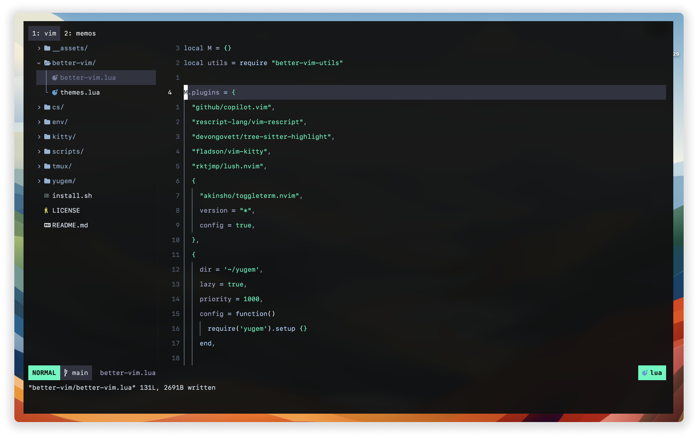

# :bulb: `~/.dotfiles`

  

### ⌨️ Neovim —— [BetterVim](https://bettervim.com)
- My BetterVim config: `bettervim/bettervim.lua`

### 💡 ZSH
  - `.zshrc`
  - My `oh-my-zsh` config
  - Support for `nvm`
  - Some useful aliases and functions

### ⌨️ Kitty 🐱
 - My custom configs
 - Themes (such as poimandres)

### 🖥️ TMUX
  - My custom `tmux` config
  - Support for `tpm` (tmux plugins manager)
      - `tmux-sensible` config.
      -  `tmux-ressurrect` config.
      -  UI and themes handled by [shifter](https://github.com/bettervim/shifter)

### 📦 General
  - `.editorconfig`
  - `.gitconfig`

## ⚖️ license
MIT
