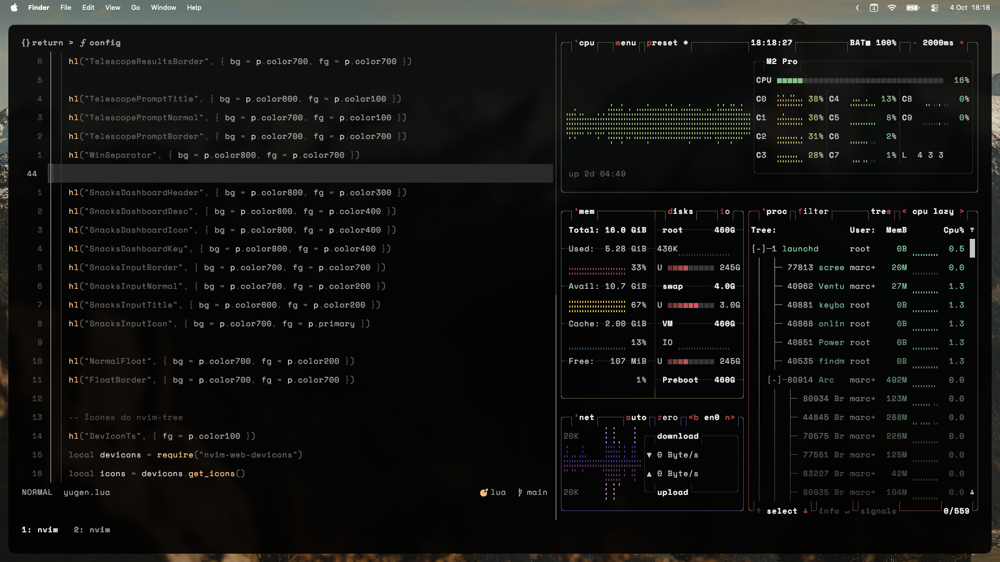
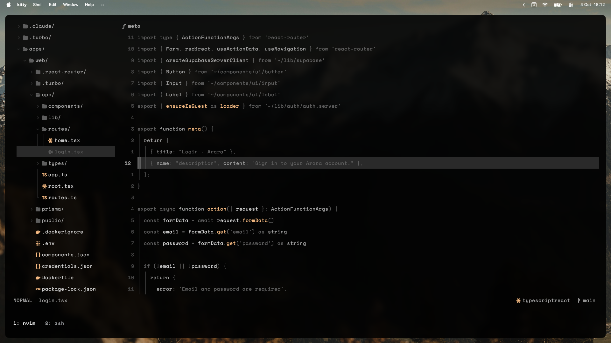
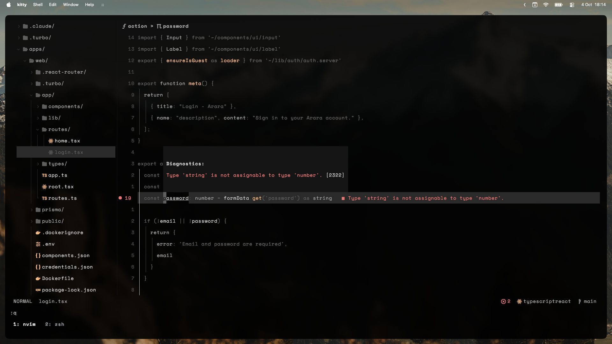
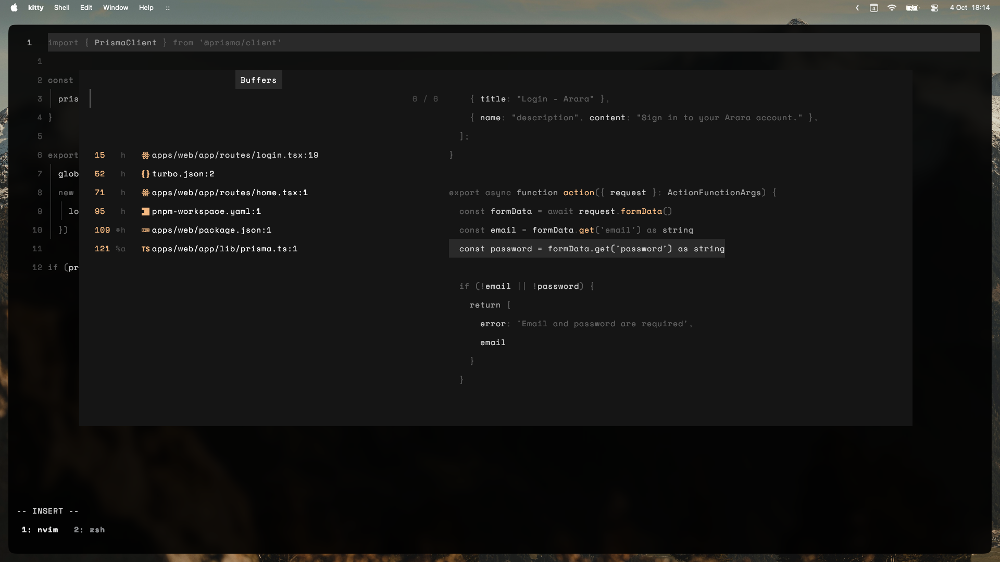

<div align="center">

# dotfiles

*Personal macOS development environment. Everything is symlinked into place; editing a file here edits it live.*

[Preview](#preview) · [Installation](#installation) · [What's inside](#whats-inside) · [Skills](#skills) · [License](#license)



</div>

---

## What it is

One repo that owns the whole machine: shell, terminal, editor, multiplexer, and the AI-agent layer on top of them. `install.sh` bootstraps a new Mac — Homebrew, packages, fonts, symlinks, nvm — and restoring any config later is just re-running it. The dark `yugen` theme is applied per-tool and kept in sync manually.

The part that evolved the most is [`agents/`](agents/): a set of skills shared across Claude Code, Cursor, and opencode that turns fuzzy ideas into shipped PRs through a documented pipeline — brainstorm, decide, plan, implement.

## Preview

<div align="center">


*Editor — Neovim with lazy.nvim*



*Dashboard*



*File finder*



*Diagnostics*

</div>

## Installation

```sh
git clone https://github.com/vmarcosp/dotfiles ~/projects/dotfiles
cd ~/projects/dotfiles && ./install.sh
```

The script is idempotent. It installs Homebrew (formulae and casks), Nerd Fonts, oh-my-zsh, and nvm, then symlinks every config to its system location. Run it again anytime to restore links or pick up new packages.

## What's inside

| Directory | What it is | Linked to |
|---|---|---|
| [`env/`](env/) | `.zshrc` (oh-my-zsh, nvm, aliases) and `.gitconfig` | `~/.zshrc`, `~/.gitconfig` |
| [`nvim/`](nvim/) | Neovim config, lazy.nvim | `~/.config/nvim` |
| [`kitty/`](kitty/) | Kitty terminal + `yugen` theme | `~/.config/kitty/` |
| [`tmux/`](tmux/) | Minimal tmux config | `~/.tmux.conf` |
| [`better-tmux/`](better-tmux/) | TypeScript/React tmux status bar | `~/.config/better-tmux` |
| [`bin/`](bin/) | Utility scripts (`notification`, `worktree`) | `~/bin/` |
| [`agents/`](agents/) | AI skills and rules, shared across tools | `~/.agents`, `~/.claude/*`, `~/.cursor/skills` |
| [`claude/`](claude/) | Global Claude Code settings | `~/.claude/settings.json` |
| [`opencode/`](opencode/) | Opencode config, plugins, themes | `~/.opencode/plugins` |
| [`cursor/`](cursor/) | Cursor hooks and MCP servers | — |
| [`wallpapers/`](wallpapers/) | Desktop wallpapers | — |

`install.sh` is the source of truth for the full symlink map.

## Skills

Skills live in [`agents/skills/`](agents/skills/) and are symlinked into every agent I use (Claude Code, Cursor, opencode), so one edit updates them everywhere. They split on one axis — who can invoke them. **User-invoked** skills only fire when I type them; they orchestrate a process. **Model-invoked** skills the agent reaches for on its own when the task fits.

### The pipeline

The core skills form a pipeline from fuzzy idea to shipped PR. Each one produces a document the next one consumes, so context survives across sessions and agents:

```
                       fuzzy idea
                           │
                     ┌─────▼──────┐
                     │ /brainstorm │  explore, stress, converge
                     └─────┬──────┘
             ┌─────────────┼─────────────┐
             ▼             ▼             ▼
        ┌────────┐    ┌────────┐    ┌────────┐
        │  /prd  │───▶│  /tdd  │    │  /adr  │
        │ the    │    │ the    │◀───│ binding│
        │ WHAT   │    │ HOW    │    │ record │
        └────┬───┘    └────┬───┘    └────┬───┘
             └──────┬──────┘─────────────┘
                    ▼
          fits in a single change?
          │ no                │ yes
    ┌─────▼─────┐             │
    │ /phasing  │             │
    │ roadmap,  │             │
    │ N phases  │             │
    └─────┬─────┘             │
          │ per phase         │
    ┌─────▼─────┐             │
    │   /spec   │◀────────────┘
    └─────┬─────┘
          ▼
    ┌───────────┐
    │/implement │  1 step = 1 verify = 1 commit → PR
    └─────┬─────┘
          ▼
  carry-over ──▶ /phasing (sync) absorbs and replans
```

- **[brainstorm](agents/skills/brainstorm/SKILL.md)** — A long-form session for a fuzzy idea, not a document generator. Grounds every claim in sources read during the session, steelmans before criticizing, measures instead of estimating, and converges into trade-offs with named prices. Exit hands off to `/prd`, `/tdd`, or `/adr`.
- **[prd](agents/skills/prd/SKILL.md)** — Writes the product requirements: who it's for, what they can do, what "done" looks like per scenario. Behavior only — mechanism is banned from the document. Feeds on a brainstorm artifact, a TDD, or a plain description.
- **[tdd](agents/skills/tdd/SKILL.md)** — Writes the technical design: how a system fits together, As-Is or To-Be, with mermaid diagrams. States the design and links the decisions that justify it instead of re-arguing them. (The name collides with test-driven development on purpose — it never fires on its own.)
- **[adr](agents/skills/adr/SKILL.md)** — Records one decision already made — context, decision, consequences. ADRs are binding downstream: `/spec` and `/implement` treat them as contracts, never suggestions.
- **[phasing](agents/skills/phasing/SKILL.md)** — Cuts settled scope into phases, each sized to be exactly one `/spec`. Builds a dependency graph, computes the critical path, and renders parallel work streams. Each phase's `/implement` leaves a carry-over fragment; a sync run absorbs them and replans.
- **[spec](agents/skills/spec/SKILL.md)** — Turns one change into an implementation plan: recon grounded in files actually read, an approach that complies with every ADR, and ordered steps where each ends on a runnable **Verify**. Decisions that outlive the change get promoted to ADRs instead of dying in the plan.
- **[implement](agents/skills/implement/SKILL.md)** — Executes the plan: one step at a time, verify, commit, next. Nothing counts as done because it looks done — only because its Verify ran and passed. Delivers the PR, and when the plan is a roadmap phase, writes the carry-over and flips the phase status.

### Utilities

Standalone skills, no pipeline attached.

**User-invoked**

- **[worktree](agents/skills/worktree/SKILL.md)** — Creates or removes a git worktree from a branch name, copying `.env` files and installing dependencies automatically.
- **[writing-great-skills](agents/skills/writing-great-skills/SKILL.md)** — The reference I load when writing or editing skills: the vocabulary and principles that make a skill predictable.

**Model-invoked**

- **[notification](agents/skills/notification/SKILL.md)** — Fires a native macOS notification when an autonomous flow needs me — a pending question, a human gate, a failure. Clicking it focuses the terminal.
- **[context7-mcp](agents/skills/context7-mcp/SKILL.md)** — Routes library and framework questions through Context7 for current docs instead of stale training data.
- **[todoist-cli](agents/skills/todoist-cli/SKILL.md)** — Manages Todoist (tasks, projects, labels, filters) through the `td` CLI.

### Rules

[`agents/rules/`](agents/rules/) holds always-on guidance every agent loads — when to reach for Context7, when to fire a notification. Repo-scoped rules and skills for this repository live in [`.agents/`](.agents/).

## License

MIT
