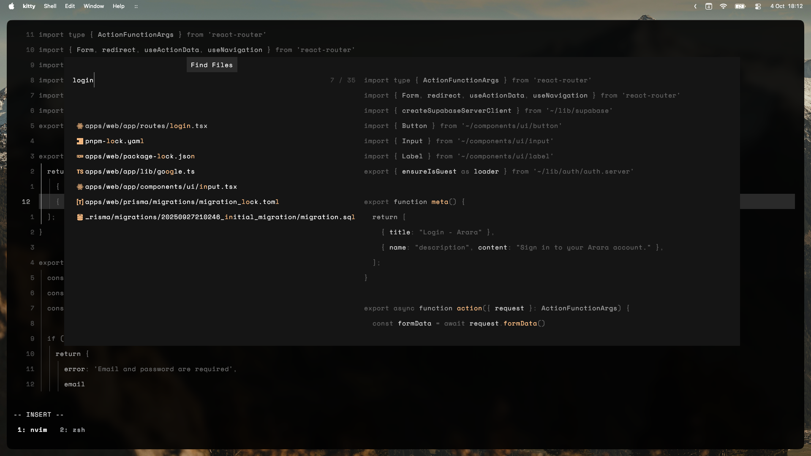
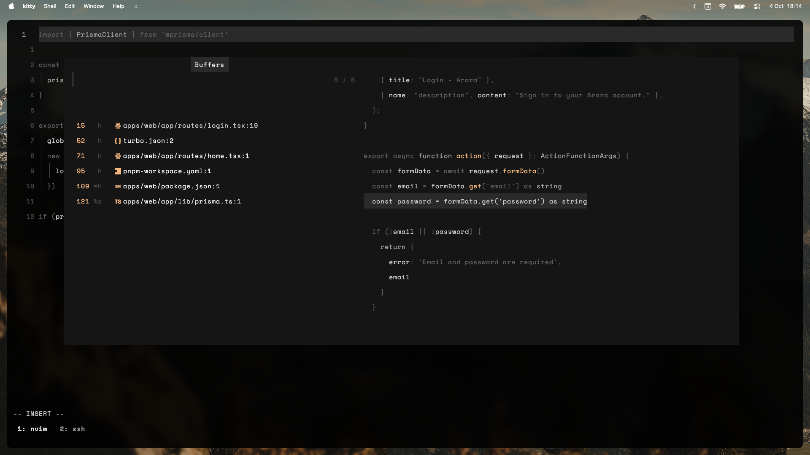

<samp>

<h1 align="center"><code>$dotfiles</code></h1>

  

<h2 align="center">Preview</h1>

  

Editor

  

Dashboard

  

File finder

  

Diagnostics

<h2 align="center">Overview</h1>

### nvim
- My nvim config
- My own theme ([yugen 幽玄](https://github.com/bettervim/yugen))

### zsh
  - `.zshrc`
  - My `oh-my-zsh` config
  - Support for `nvm`
  - Some useful aliases and functions

### kitty
 - My custom configs
 - My own theme (yugen 幽玄)

### tmux
  - My custom `tmux` config
  - Support for `tpm` (tmux plugins manager)
      - `tmux-sensible` config.
      -  `tmux-ressurrect` config
  -  My own theme (yugen 幽玄)

### misc
  - `.editorconfig`
  - `.gitconfig`

<h2 align="center">License</h2>
MIT
</samp>
