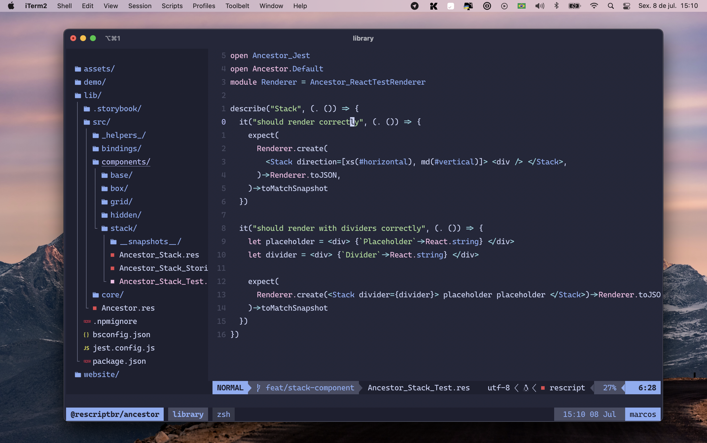

# :bulb: `~/.dotfiles`
<h2 align="center">
  
   
 </h2>

### `nvim`
  - `nvim.tree`
  - `telescope.nvim`
  - `which.key`
  - `coc.nvim` + `vim-rescript`
  - Theme: `catppuccin/nvim`
  - My custom bindings

### `zsh`
  - `.zshrc`
  - ohmyzsh config
  - zsh-nvm

### `tmux`
  - My custom themes for `oceanic-next`, `gruvbox`, `iceberg`, `ayu`, `catpuccin`, etc.
  - My custom `oh-my-tmux` config
  - `tmux.resurrect`

### `config`
  - `.editorconfig`
  - `.gitconfig`
