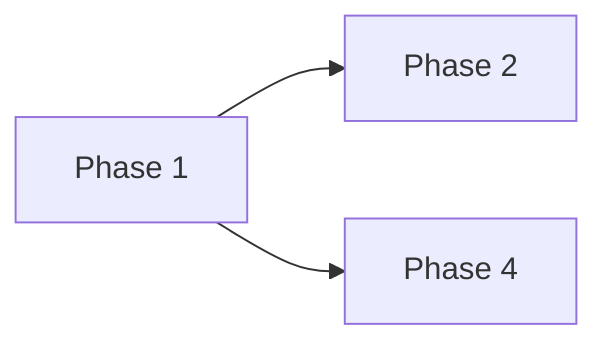

# {Scope Name} — Roadmap

> **Status**: {Draft | Active | Done}
> **Last updated**: {date}

## Goal

{One sentence, from the PRD: what the finished scope delivers.}

## Phases

| # | Phase | Depends on | Status |
|---|---|---|---|
| 1 | {Short title, 4–10 words} | {— or #N, #M} | {Pending \| Spec'd \| Done} |

### Phase 1 — {Short title}

**Goal:** {One or two sentences: what changes when this ships.}

**In:** {capabilities this phase delivers, plain language}
**Out:** {what it deliberately leaves to a sibling — name the owning phase, e.g. "the real adapter (#8)"}

**Source:** {doc, linked} — {`Top > Section > Subsection` heading paths this phase implements}

**Notes for the spec:** {optional — facts the phase's /spec cannot infer; omit the line when empty}

{Repeat one block per phase, in table order.}

## Dependency Graph

## Streams

- **Critical path**: {N} phases ({#1 → #2 → #3})
- **Max parallelism**: {N} (widest wave: {#4, #5})

| Stream | Phases, in order |
|---|---|
| A | {#1, #2, #3} |
| B | {#4} |

## Carry-over Log

{Entries absorbed from phase fragments during Sync — omit until the first Sync.}

| Type | From | Affects | Note | Link |
|---|---|---|---|---|
| {Fact \| Dependency correction \| New scope \| Doc correction} | {#N} | {#M / roadmap / doc} | {one line} | {PR/commit} |

## Carry-over Paths (reserved)

{Where each phase's `/implement` writes its fragment — reserved, not yet written. Lives alongside this doc, same folder.}

| Phase | Path |
|---|---|
| #1 | `carryover-phase-1.md` |

## References

| Doc | Type | Why it matters here |
|---|---|---|
| {prd-slug, linked} | Reference | {What this roadmap took from it} |
| {tdd-slug, linked} | Reference | {Building Blocks used to cut phases} |
| {adr-NNNN, linked} | Binding | {Constraint that forced an order or a split} |

## Open Questions

{Genuinely unresolved — omit if none.}
