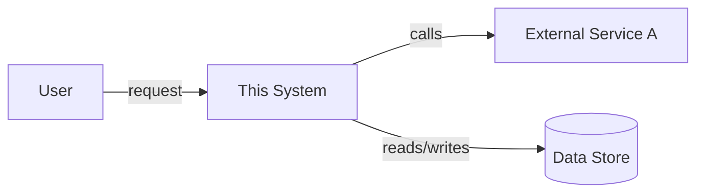
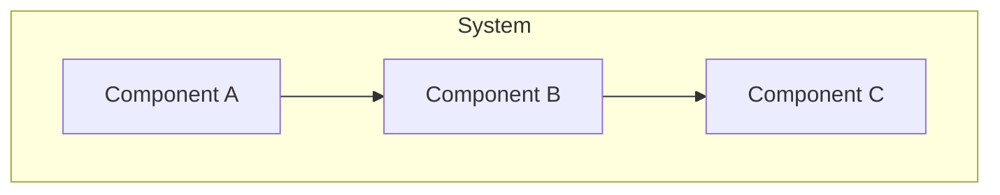
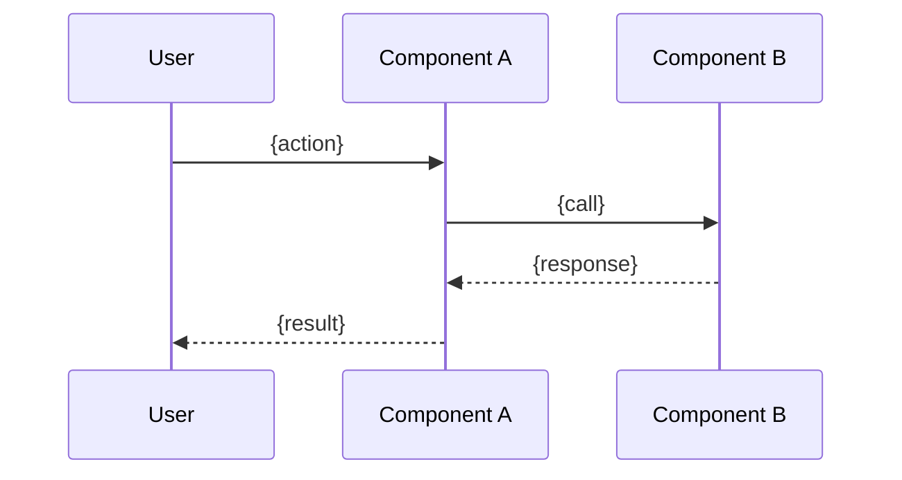
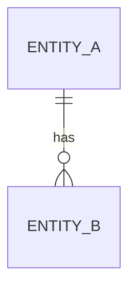

# {System, Subsystem, or Component Name}

> **Mode**: {As-Is | To-Be}
> **Last updated**: {date}

## Overview

{One paragraph: what the system does, who/what it serves, its boundary — what's inside vs outside this document's scope.}

## System Context

{How this system relates to actors and external systems. Mermaid `flowchart` or `C4Context`-style diagram.}

## Building Blocks

{Every component/service/module with a one-line responsibility. One row each — no prose padding.}

| Component | Responsibility | Owns |
|---|---|---|
| {Component} | {What it does, one line} | {Data/resource it owns, if any} |

## Key Flows

{One subsection per flow that matters — the ones a reader needs to understand the system, not every possible path.}

### {Flow Name}

{One-paragraph walkthrough, then the diagram.}

## Data Model

{Core entities and how they relate. Skip if the system has no meaningful data model of its own.}

## Interfaces

{APIs, events, or contracts this system exposes or consumes.}

| Interface | Direction | Contract |
|---|---|---|
| {Endpoint/event/queue} | {Exposes / Consumes} | {Shape, or link to schema} |

## Cross-Cutting Concerns

{Only what's actually relevant — deployment topology, scaling, security boundaries, observability. Omit a subsection entirely rather than writing "N/A".}

## References

{The anchor docs this design depends on — PRDs, ADRs, brainstorm convergence docs. Link, don't restate their content. If no written anchor exists and this design came from the user's own description, say so instead of leaving the table empty.}

| Doc | Why it matters here |
|---|---|
| {adr-NNNN / prd-slug / brainstorm-slug, linked} | {One line: what this design takes from it} |

## Open Questions

{Genuinely unresolved design questions only — omit this section if there are none.}
