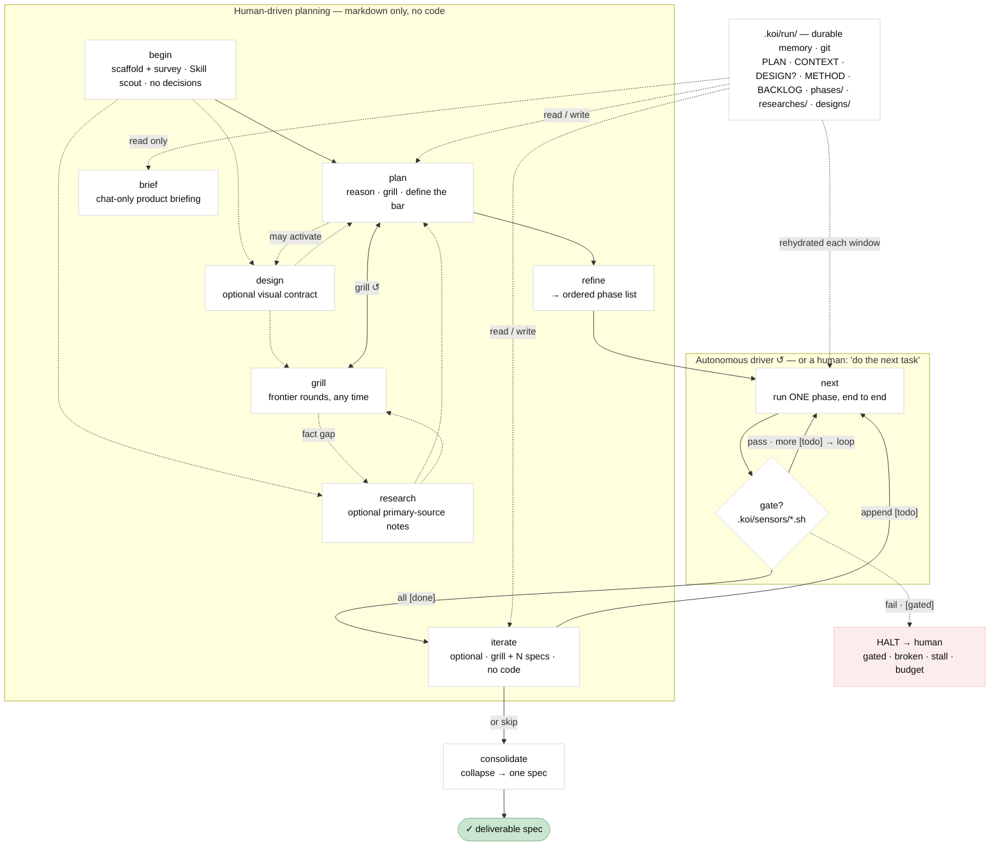
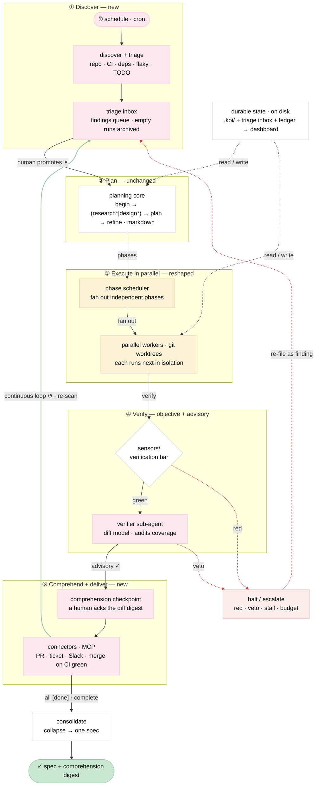
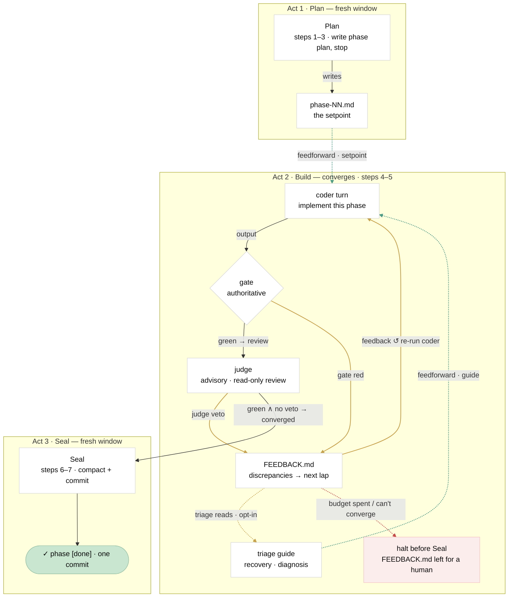

# Junji — diagrams

Mermaid renderings of three views of junji: the method **as built**, a
**loop-engineering-native** variant, and the **Build** feedback/feedforward
self-correction loop. (An interactive HTML version can be generated separately
with the `richview` skill.)

**Node colour legend**: pink = new · butter = reshaped · white = unchanged ·
mint = terminal · blush = halt.
**Edge legend (diagram 3)**: gray = control flow · solid amber = feedback
(measured error → next lap) · dotted green = feedforward (injected ahead) ·
dotted red = non-convergence.

> Rendering: GitHub, VS Code (Mermaid extension), Obsidian, and
> <https://mermaid.live> all render these. Colours come from `classDef` /
> `linkStyle`; if a viewer ignores those, the structure and labels still read.

---

## 1. Junji today

A human runs `begin → (research*|design*) → plan → refine` (markdown only; research and design optional);
A human or thin driver repeats `next`, one phase at a time, until every phase is `[done]`. Then a
human **consolidates**, or **`iterate`s** (grill + N specs, no code) and `next` again. Optional `brief`
reads `.koi/run/` and reports in chat; it writes nothing. Everything else reads and writes `.koi/`.

---

## 2. Loop-engineering fit

The finite project loop becomes one turn of a perpetual loop: a scheduled scan
files findings into an inbox; promoted findings enter the unchanged planning
core; phases fan out across parallel worktrees; each is verified by the gate
**and** an independent checker; a human acks a comprehension digest; connectors
ship it: and everything, completions and escalations alike, returns to the
inbox. The objective gate stays the sole arbiter.

---

## 3. Build — the feedback / feedforward loop inside a phase

The 3-act path (Plan → Build → Seal) the driver runs per phase. Act 2 is
a closed control loop. **Feedback** (amber): gate-red and judge-veto findings go
to `FEEDBACK.md` and feed the next lap. **Feedforward** (dotted green): the phase
plan (setpoint) and the recovery guide are injected *ahead* of the coder. The
gate is the authoritative sensor (grants convergence); the judge is advisory (can
veto, never grant).

---

*Sources: `skills/junji/SKILL.md`, [the Junji guide](https://github.com/getkoi/site/blob/main/src/content/docs/junji/guide.mdx),
`skills/junji/references/autonomous-driver.md`, and Addy Osmani's "Loop
engineering" (addyosmani.com/blog/loop-engineering).*
